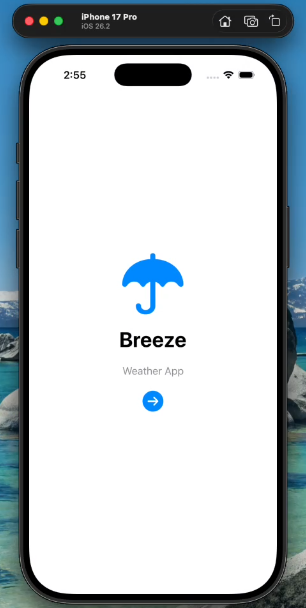
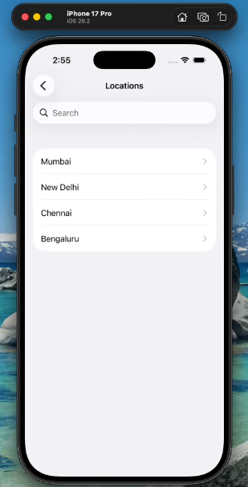
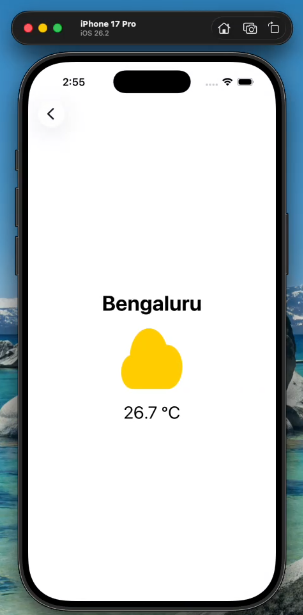

# WeatherApp 

## 📱 App Screens (Initial Version)

###  Home Screen

###  City List Screen

###  Weather Detail Screen

---

##  Project Structure

### Views (UI Screens)
- `ContentView.swift` →  Home screen  
- `ListScreen.swift` → City list screen   
- `DetailScreen.swift` → Weather detail screen  

### Models (Data)
- `Location.swift` → City model  
- `Temperature.swift` → Temperature model   
- `Weather.swift` → Weather type and system icon mapping  
- `LocationData.swift` → Static list of cities with coordinates  

---

##  Updated Features (Latest Version)

updated the app using **real-time weather data** from the **Open-Meteo API**.

###  Home Screen (Updated)

###  City List Screen (Updated)

###  Weather Detail Screen (Updated)

##  New Features

- Integrated **Open-Meteo Weather API**
- Fetches **live temperature** using latitude & longitude
- Weather icons are shown based on temperature range
- Detail screen now updates dynamically from API

