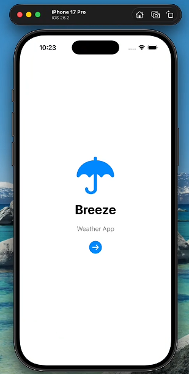
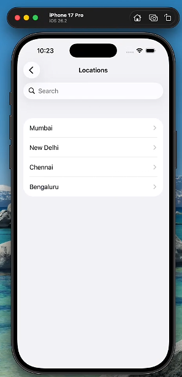
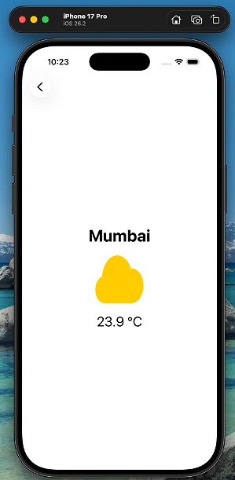
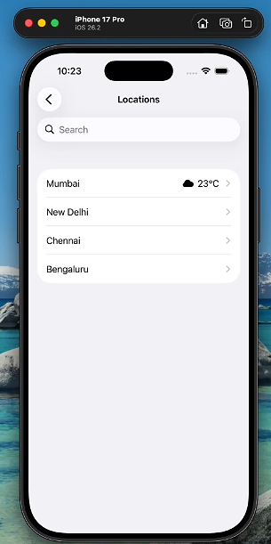
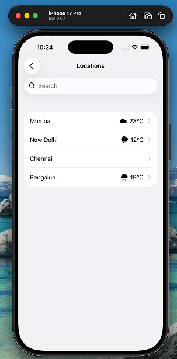

# WeatherApp 

## App Screens

### Home Screen

### City List Screen

### Weather Detail Screen

---

## Features

- Fetches real-time temperature using the Open-Meteo Weather API  
- Displays weather details for selected cities  
- Shows weather icons based on temperature range  
- Uses MVVM architecture to separate UI and logic  
- Uses Core Data to store weather data and update the list screen  

---
