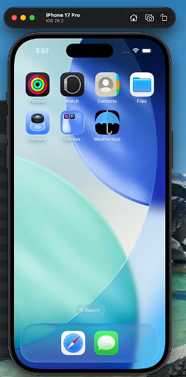
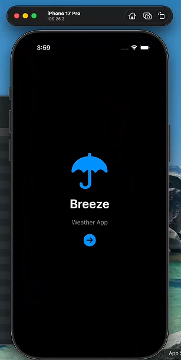
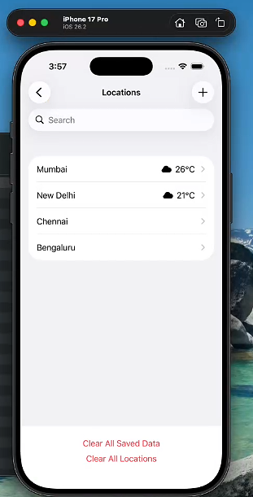
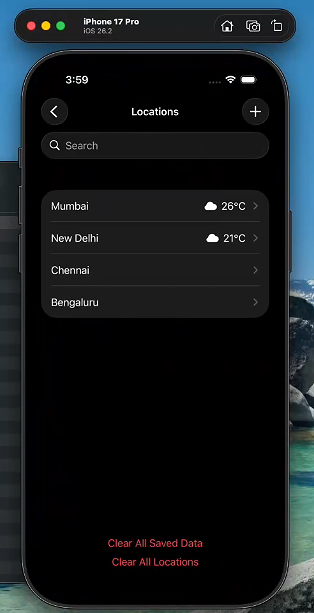
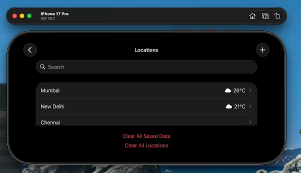
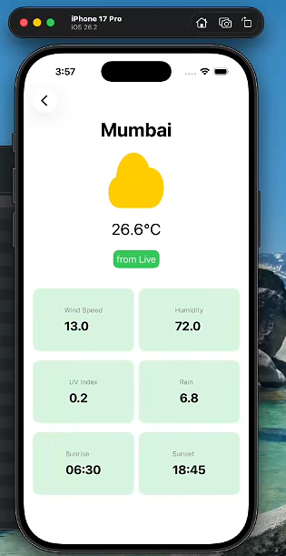
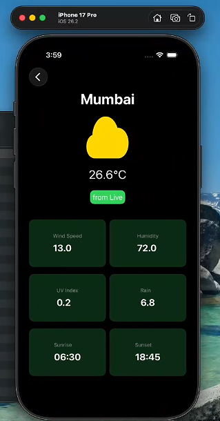
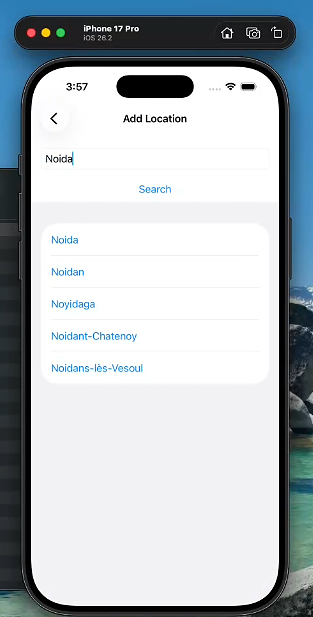

# WeatherApp 

## App Screens

### App Icon

---

### Home Screen

#### Light Mode

#### Dark Mode

---

### City List Screen

#### Light Mode

#### Dark Mode

#### Landscape Mode

---

### Weather Detail Screen

#### Light Mode

#### Dark Mode

---

### Search Screen

---

## Features

- Fetches real-time weather data using the Open-Meteo Weather API  
- Search and add new locations dynamically using Geocoding API  
- Displays Live and Saved weather data with proper indicators  
- Shows weather details including:
  - Temperature
  - Wind Speed
  - Humidity
  - Weather Icon
- Supports deleting saved weather data and removing locations  
- Stores weather data locally using Core Data  
- Uses MVVM architecture for clean separation of concerns  
- Supports Light Mode and Dark Mode UI  
- Modern SwiftUI UI with reusable components  

